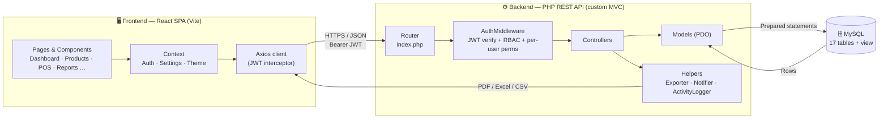
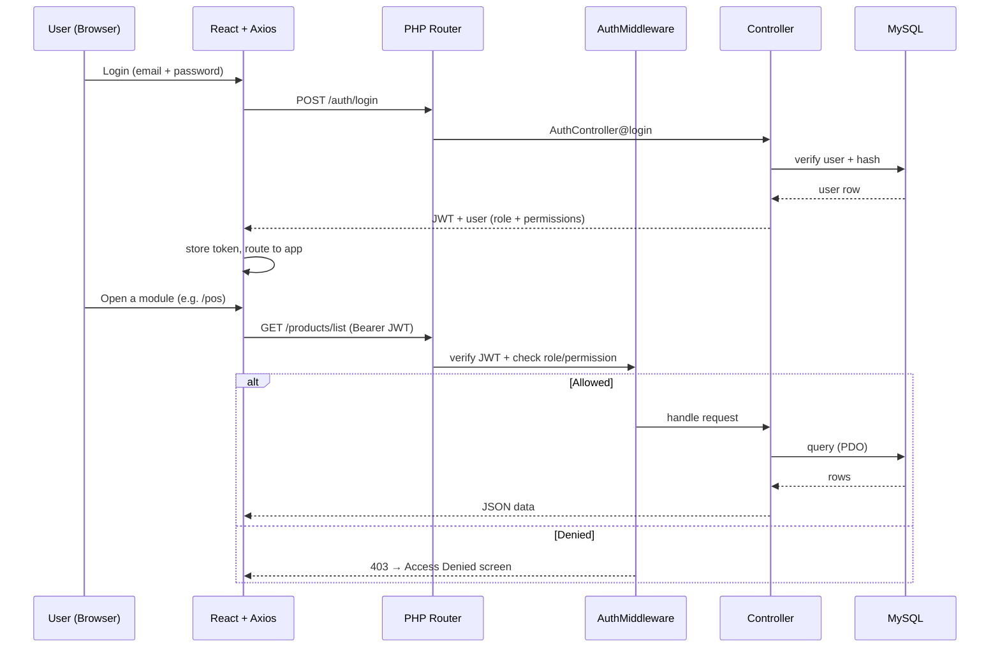
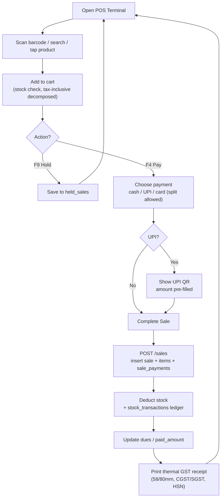
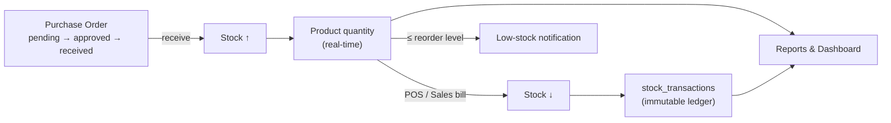
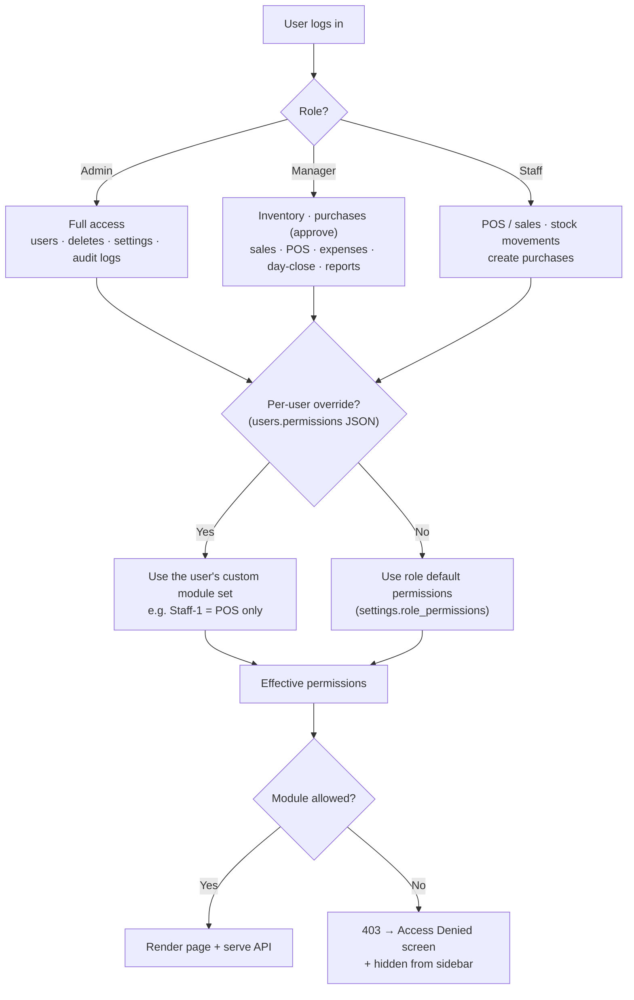
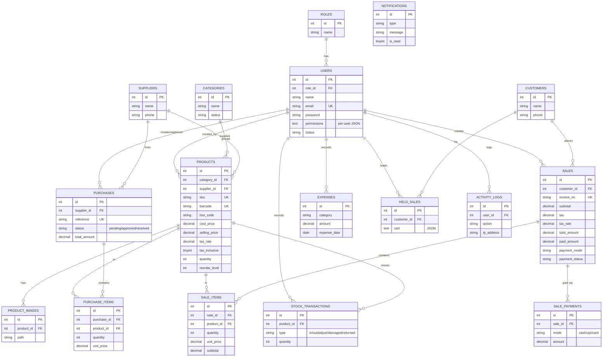

# Inventra Mart — Inventory Management & POS Billing System

A full-stack, role-based **inventory + point-of-sale (POS)** system built with **React.js**, a **PHP REST API** (custom MVC, JWT auth), and **MySQL**. It covers products, categories, suppliers, customers, purchases (with an approval workflow), sales & invoicing, a dedicated **POS billing terminal** with GST, payments/dues, expenses, day-close (Z-report), real-time stock movements, notifications, analytics dashboards, audit logs, granular per-user permissions, and PDF/Excel/CSV report exports.

> Installable as a **PWA**, ships with **dark mode**, a **barcode/QR scanner**, thermal **GST receipts**, and **UPI QR** payments.

---

## ✨ Tech Stack

| Layer | Technology |
|-------|-----------|
| Frontend | React 18 + Vite, Bootstrap 5, Bootstrap Icons, Chart.js, Axios, React Router, React-Toastify |
| POS extras | `html5-qrcode` (camera scan), `qrcode.react` (UPI QR), `jsbarcode` (barcode labels) |
| Backend | PHP 8 (custom lightweight MVC + REST router), self-contained JWT (HS256) |
| Database | MySQL 8 (fully normalized, 17 tables + a low-stock view + a dynamic `settings` table) |
| Exports | TCPDF (PDF) + PhpSpreadsheet (Excel) when installed via Composer; native CSV & printable-HTML fallbacks otherwise |
| PWA | Web App Manifest + service worker (installable, offline app shell) |

---

## 📁 Project Structure

```
Inventra/
├── database/
│   ├── stockhive.sql               # Full schema + seed data + low-stock view (self-complete)
│   ├── upgrade_features.sql        # Idempotent migration: GST / payments / held sales / expenses
│   ├── upgrade_pos.sql             # POS-related migration
│   └── upgrade_user_permissions.sql# Per-user permissions migration
├── backend/                        # PHP REST API
│   ├── index.php                   # Front controller + all route definitions
│   ├── .htaccess                   # Clean-URL rewriting + Authorization passthrough
│   ├── composer.json               # Optional TCPDF / PhpSpreadsheet deps
│   ├── config/                     # config.php (DB/JWT), Database.php (PDO)
│   ├── core/                       # Router, Controller, Model, Request, Response, JWT, Validator
│   ├── controllers/                # One controller per module (POS, Expense, HeldSale, Search, …)
│   ├── models/                     # One model per table + Report & Setting models
│   ├── middleware/                 # AuthMiddleware (JWT verify + RBAC + per-user permissions)
│   ├── helpers/                    # ActivityLogger, Notifier, Exporter
│   └── uploads/                    # Product images + user avatars
└── frontend/                       # React SPA
    ├── .env                        # VITE_API_BASE
    ├── public/                     # manifest.webmanifest, sw.js, PWA icons
    └── src/
        ├── api/client.js           # Axios instance + interceptors
        ├── context/                # AuthContext (JWT + roles), SettingsContext, ThemeContext
        ├── components/             # Layout, Sidebar, Topbar, Receipt, BarcodeScanner, BarcodeLabels, …
        ├── pages/                  # Dashboard, Products, Sales, POS, Expenses, DayClose, Reports, Settings, …
        └── utils/format.js
```

---

## 🔄 Architecture & Workflow

### System architecture



### Request lifecycle (auth + RBAC)



### POS billing workflow



### Stock & data flow (purchase → sale)



### User roles & permission resolution



> Admins set these in *Settings → Role Permissions* — either a whole-role default or a specific-user override. The same effective permissions gate both the **sidebar/routes (frontend)** and the **API (AuthMiddleware)**.

---

## 🚀 Setup

### Prerequisites
- XAMPP (Apache + PHP 8.1+) — or PHP's built-in server
- MySQL 8
- Node.js 18+

### 1. Database
Import the schema (creates the `stockhive` database, all tables, the low-stock view, and demo data):

```bash
# Using MySQL CLI
mysql -u root -p < database/stockhive.sql

# …or import database/stockhive.sql via phpMyAdmin / MySQL Workbench
```

> ⚠️ **Already have data?** `stockhive.sql` is self-complete and safe to import on a fresh DB. To add only the newer POS/GST/permissions features to an **existing** database without wiping data, run the idempotent `database/upgrade_*.sql` migrations instead of re-importing `stockhive.sql`.

### 2. Backend
Edit **`backend/config/config.php`** and set your DB credentials:

```php
define('DB_HOST', '127.0.0.1');
define('DB_PORT', '3306');
define('DB_NAME', 'stockhive');
define('DB_USER', 'root');
define('DB_PASS', 'your_password');
```

With **XAMPP**, place the project in `htdocs/` (it already is) — the API is served at:
`http://localhost/Inventra/backend`

> Optional (true PDF/XLSX exports): `cd backend && composer install`
> Without Composer, exports still work via CSV and a printable HTML view.

### 3. Frontend
```bash
cd frontend
npm install
npm run dev          # http://localhost:5173
npm run build        # production build → dist/
```

The frontend reads the API URL from **`frontend/.env`**:
```
VITE_API_BASE=http://localhost/Inventra/backend
```
(If you run the backend with PHP's built-in server instead — `php -S 127.0.0.1:8765 backend/index.php` — set this to `http://localhost:8765`.)

---

## 🔑 Demo Accounts

All demo users share the password **`Password@123`**.

| Role | Email | Capabilities |
|------|-------|--------------|
| **Admin** | `admin@stockhive.test` | Everything incl. users, deletes, audit logs, settings |
| **Manager** | `manager@stockhive.test` | Inventory, purchases (approve), sales, POS, expenses, day-close, reports |
| **Staff** | `staff@stockhive.test` | POS/sales, stock movements, create purchases (scope tunable per user) |

> **Per-user permissions:** beyond role defaults, Admins can grant/revoke individual modules for a **specific user** in *Settings → Role Permissions* (e.g. make one Staff user POS-only while another Staff user gets a different module set).

---

## 🧩 Modules

- **Auth & RBAC** — JWT login/logout, forgot/change password, role-based **and per-user** route + API guards, activity logging, premium **Access Denied** display.
- **Dashboard** — totals, revenue, low-stock alerts, recent activity, sales-vs-purchases bar chart, category doughnut, 7-day sales line chart, top products, date-range filter.
- **Categories / Suppliers / Customers** — CRUD, search, status, history tracking, **bulk delete** (with in-use safety checks).
- **Products** — CRUD, image upload, auto **SKU** + **barcode** generation, **barcode/QR scan to auto-fill**, printable **barcode labels**, HSN codes, GST %, tax-inclusive pricing, reorder levels, filters, **bulk CSV import/export**, bulk delete.
- **Purchases** — purchase orders with **pending → approved → received** workflow; receiving updates stock.
- **Sales** — multi-line sales entry, stock-availability checks, auto invoice numbers, printable GST invoices, payments & dues.
- **POS Terminal** — full-screen touch/keyboard billing: live product grid, barcode scan, quick keys (**F2** new · **F4** pay · **F9** hold · **/** search), **hold/resume bills**, **split payments** (cash/UPI/card), partial payment, **UPI QR with the bill amount pre-filled**, and a thermal **58mm/80mm GST receipt** (CGST/SGST split, HSN) ready to print.
- **Expenses** — category-wise business expense tracking (CRUD).
- **Day Close** — end-of-day **Z-report** with sales totals, payment-mode breakdown, and GST summary.
- **Stock** — stock in/out/adjustment/damaged/returned, immutable movement ledger, real-time quantity updates.
- **Global Search** — search products, customers and invoices from the top bar.
- **Notifications** — low-stock / out-of-stock / purchase-approval alerts (gated per permission).
- **Reports (20 types)** — product, inventory, purchase, sales, supplier, customer, profit · **GST/Tax, HSN summary, payment-mode, outstanding dues** · **expense, profit & loss, sales summary** · **stock valuation, low-stock/reorder, dead/slow stock, stock-movement ledger** · **cashier/salesperson, customer ledger** — all exportable to **PDF / Excel / CSV / Print**.
- **System Settings** — timezone, currency, business contact info, **GST & shop details** (GSTIN, shop address/state, UPI ID), default thresholds, role & per-user permissions.
- **Audit Logs** — login, CRUD, stock, settings, and export activity with IP/user-agent.
- **UX** — **dark mode** toggle, mobile-responsive top bar, installable **PWA** (offline app shell).

---

## 🗄️ Database (normalized)

`roles · users · categories · suppliers · customers · products · product_images · purchases · purchase_items · sales · sale_items · stock_transactions · notifications · activity_logs · sale_payments · held_sales · expenses` + a `v_low_stock` view + a dynamically-ensured `settings` table.

Notable columns added for POS/GST: `products.hsn_code / tax_rate / tax_inclusive`, `sales.tax_rate / paid_amount / payment_mode`, and `users.permissions` (per-user JSON overrides).

All relationships use proper foreign keys with `ON UPDATE/DELETE` rules, plus indexes on lookup/search columns and unique constraints on `email`, `sku`, `barcode`, `invoice_no`, and `reference`.

### Entity-Relationship diagram



---

## 📜 Development Journey (What we built, start → now)

A chronological log of how Inventra Mart grew from a base inventory app into a full POS + GST billing suite.

### Phase 1 — Core inventory foundation
- PHP 8 custom MVC (Router, Controller, Model, Request, Response, JWT, Validator) + MySQL via PDO.
- React 18 + Vite SPA with JWT auth, AuthContext, protected routes, premium **Access Denied** screen.
- Modules: **Roles/Users, Categories, Suppliers, Customers, Products** (image upload, auto SKU/barcode, reorder levels), **Purchases** (pending→approved→received), **Sales** (multi-line, auto invoices), **Stock movements** (immutable ledger), **Notifications**, **Dashboard** (charts), **Audit Logs**, base **Reports** (7 types) with PDF/Excel/CSV/Print.

### Phase 2 — POS billing suite
- Dedicated full-screen **POS Terminal** (`/pos`): live product grid, customer selector, cart, discount, GST slabs.
- **Barcode/scan-or-search** add to cart; keyboard quick keys — **F2** new · **F4** pay · **F9** hold · **/** search.
- **Hold / resume bills** (`held_sales` table + endpoints).
- Thermal **GST receipt** component (58mm / 80mm) with CGST/SGST split + HSN, print-ready.

### Phase 3 — GST, tax & shop billing details
- Products gained **HSN code**, **GST %**, and **tax-inclusive** pricing (tax decomposed at billing).
- Sales gained `tax_rate`, `paid_amount`, `payment_mode`.
- Settings gained **GSTIN, shop address, shop state, UPI ID** (new "Billing & GST" tab).
- Schema folded into `stockhive.sql` for durable re-imports + idempotent `upgrade_*.sql` migrations.

### Phase 4 — Payments & dues
- **Split payments** (cash / UPI / card) with a `sale_payments` table; partial payment + outstanding **dues**.
- **UPI QR** on the payment screen with the **bill amount pre-filled** (normalised NPCI deep-link).

### Phase 5 — Expenses & Day Close
- **Expenses** module (category-wise CRUD, `expenses` table).
- **Day Close** page — end-of-day **Z-report** (sales totals, payment-mode breakdown, GST summary).

### Phase 6 — Granular access control
- **Per-user permissions** (`users.permissions` JSON) layered on top of role defaults, enforced server-side in `AuthMiddleware` and client-side in Sidebar/ProtectedRoute.
- *Settings → Role Permissions* gained a **specific-user selector** (e.g. one Staff = POS-only, another Staff = a different module set).
- `pos` permission implies products/customers/sales; notification polling gated so disabled roles don't get 403 toasts.

### Phase 7 — Reports expansion (7 → 20)
- Added 13 report builders: **GST/Tax, HSN summary, payment-mode, outstanding dues, expense, profit & loss, sales summary, stock valuation, low-stock/reorder, dead/slow stock, stock-movement ledger, cashier/salesperson, customer ledger** — all exportable.

### Phase 8 — UX, scanning & PWA
- **Barcode/QR scanner** in the *Add Product* form (scan → auto-fill / load existing); printable **barcode labels** (`jsbarcode`).
- **Bulk CSV import/export** for products (with GST columns); **bulk delete** for products & categories (with in-use safety skips).
- **Dark mode** (ThemeContext) and a **mobile-responsive top bar** (menu · centered brand · search/notification/theme/profile).
- **Global search** (products / customers / invoices) in the top bar.
- Installable **PWA** — web manifest, service worker, offline app shell, app icons.

### Phase 9 — Polish & fixes
- Thermal receipt print fixed to a clean **80/58mm slip** (`@page` sizing, no browser header/footer, no A4 stretch).
- UPI QR amount robustly 2-decimal formatted so apps reliably auto-fill.
- Page-header / filter button spacing fixes; removed the "Database Connected" badge; tidied filter toggle gaps.

---

## 🔒 Security Notes

- Passwords hashed with `password_hash` (bcrypt).
- All write endpoints validate input and enforce **role + per-user permissions server-side** (never trust the client).
- Prepared statements (PDO) everywhere — no string-concatenated SQL.
- Change `JWT_SECRET` in `config.php` before any non-local deployment and set `APP_ENV` to `production`.
